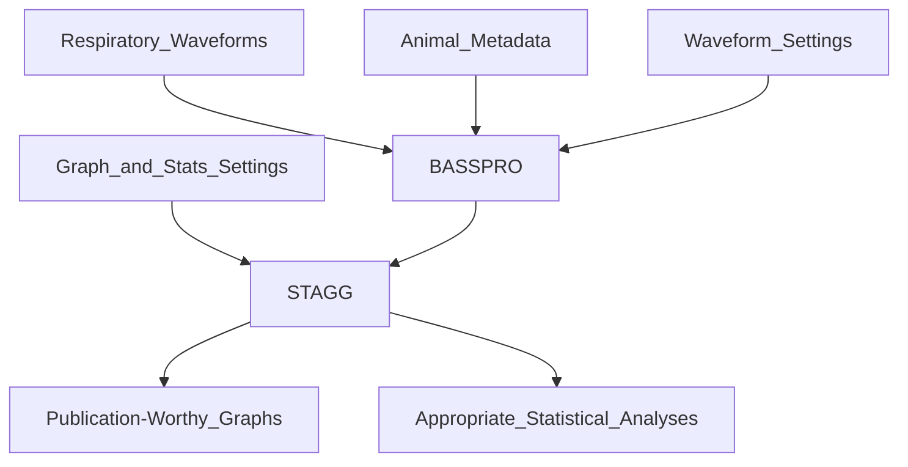

# 
<picture>
  <source media="(prefers-color-scheme: dark)" srcset="https://github.com/MolecularNeurobiology/BASSPRO-STAGG/blob/main/Logo_2.png"raw=true width="350">
  <source media="(prefers-color-scheme: light)" srcset="https://github.com/MolecularNeurobiology/BASSPRO-STAGG/blob/main/Logo.png"raw=true width="350">
  
</picture>

## What is it?
Breathe Easy is an automated waveform analysis pipeline for data gathered in whole animal plethysmography experiments. It utilizes python, pyQT, and R languages in three modules 1) Breathing Analysis Selection and Segmentation for Plethysmography and Respiratory Observations (BASSPRO), 2) Statistics And Graph Generator (STAGG), and a graphical user interface (GUI) to allow for high-thruput, consistent analysis of respiratory waveforms.

## How to cite this software?

# Where to get it?
Our software is available as source code and as a windows executable with all dependencies for the release. The executable is available in the BASSPRO-STAGG_QUIPPL folder and can be launched after downloading to a PC. 

# Where is the manual?
[User Manual](/BPSt_Guide_V6.pdf) for this software.
[BASSPRO](/docs/index.html)

# Where is practice data?
Instructions for accessing, downloading, and running practice datasets can be found in the [User Manual](/BPSt_Guide_V6.pdf).

# Dependencies
All dependencies are automatically installed when running Breathe Easy. However, we've included all required packages and installation commands below.
- numpy==1.23.1 
- pandas==1.4.3
- pyodbc==4.0.34
- PyQt5==5.15.7
- PyQt5-Qt5==5.15.2
- PyQt5-sip==12.11.0
- python-dateutil==2.8.2
- pytz==2022.1
- scipy==1.9.0
- six==1.16.0

# How to launch?
Double click the `launch.bat` file in the BASSPRO-STAGG_QUIPPL folder.

# Licensing
***Whatever Baylor tells us to do.***
