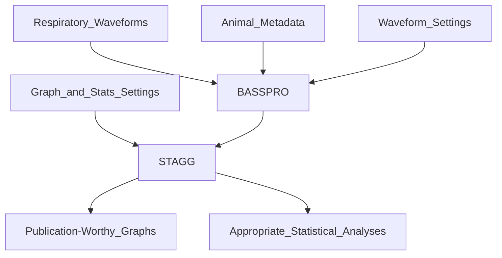

# 
<picture>
  <source media="(prefers-color-scheme: dark)" srcset="https://github.com/MolecularNeurobiology/BASSPRO-STAGG/blob/main/Logo_2.png"raw=true width="350">
  <source media="(prefers-color-scheme: light)" srcset="https://github.com/MolecularNeurobiology/BASSPRO-STAGG/blob/main/Logo.png"raw=true width="350">
  
</picture>

# What is it?
Breathe Easy is an automated waveform analysis pipeline for data gathered in whole animal plethysmography experiments. It utilizes python, pyQT, and R languages in three modules 1) Breathing Analysis Selection and Segmentation for Plethysmography and Respiratory Observations (BASSPRO), 2) Statistics And Graph Generator (STAGG), and a graphical user interface (GUI) to allow for high-thruput, consistent analysis of respiratory waveforms.



# Main Features
What does Breathe Easy breeze through?

1. Analysis of [manually selected data](https://molecularneurobiology.github.io/BASSPRO-STAGG/ManualSettings.html#manual-settings-configuration) from whole body plethysmography recordings
2. [Automated selection and analysis](https://molecularneurobiology.github.io/BASSPRO-STAGG/Autosettings.html) of calm, quiet breathing from desired sections within whole body plethysmography recordings
4. Harnesses the graphical power of R Studio to [produce publication-ready figures](https://molecularneurobiology.github.io/BASSPRO-STAGG/STAGGsettings.html#assign-graph-roles) of all desired respiratory and metadata variables
3. Perform [advanced statistical analyses](https://molecularneurobiology.github.io/BASSPRO-STAGG/STAGGsettings.html) on par with even the most complex experimental designs

# Where to get it?
Our software is available as source code and as a windows executable with all dependencies for the release. The executable is available in the BASSPRO-STAGG_QUIPPL folder and can be launched after downloading to a PC. See our [install page](https://molecularneurobiology.github.io/BASSPRO-STAGG/usage.html) for more information.

# Where is the manual?
Access the full user manual for this software [here](https://molecularneurobiology.github.io/BASSPRO-STAGG/).

# Where is practice data?
Instructions for accessing, downloading, and running practice datasets can be found in the [vignette section of our user manual](https://molecularneurobiology.github.io/BASSPRO-STAGG/Vignette.html). Instructions to download the larger datasets for this example are found in the vignette instructions at the link provided. 

# Dependencies
The prepackaged release of Breathe Easy includes all dependencies. If running from source, you will need to ensure download and installation of dependencies which can be done using instructions in the Installation section below. For a list of all dependencies, see the requirements.txt file.

## Installation
### Install Python3
Download python [here](https://www.python.org/downloads/)

### Install Python Dependencies
Activate Python virtual environment to help manage package installation.
```
# Posix
python3 -m venv <venv>
source <venv>/bin/activate

# Windows
python3 -m venv <venv>
<venv>/Scripts/activate.bat
```
Install dependencies
```
pip install -r requirements.txt
```
### Install R Dependencies
Dependencies for R should be downloaded and installed upon the first run of STAGG. 

# How to launch?
## From packaged version
Double click the `launch.bat` file in the BASSPRO-STAGG_QUIPPL folder.

## From source
```
# Posix
source venv/bin/activate
python3 scripts/GUI/MainGUImain.py

# Windows
<venv>/Scripts/activate.bat
python3 scripts/GUI/MainGUImain.py
```

# Licensing
'Breathe Easy' is dually licensed. The project (BASSPRO, STAGG, and GUI components) is available under a 'GPLv3 or later' license as well as a commercial license (inquiries for commercial licensing may be directed to Russell.Ray@bcm.edu). The fully packaged version of 'Breathe Easy is distributed under a 'GPLv2 or later' license.

    Breathe Easy - an automated waveform analysis pipeline
    Copyright (C) 2022  
    Savannah Lusk, Andersen Chang, 
    Avery Twitchell-Heyne, Shaun Fattig, 
    Christopher Scott Ward, Russell Ray.

    This program is free software: you can redistribute it and/or modify
    it under the terms of the GNU General Public License as published by
    the Free Software Foundation, either version 3 of the License, or
    any later version.

    This program is distributed in the hope that it will be useful,
    but WITHOUT ANY WARRANTY; without even the implied warranty of
    MERCHANTABILITY or FITNESS FOR A PARTICULAR PURPOSE.  See the
    GNU General Public License for more details.

    You should have received a copy of the GNU General Public License
    along with this program.  If not, see <https://www.gnu.org/licenses/>.
