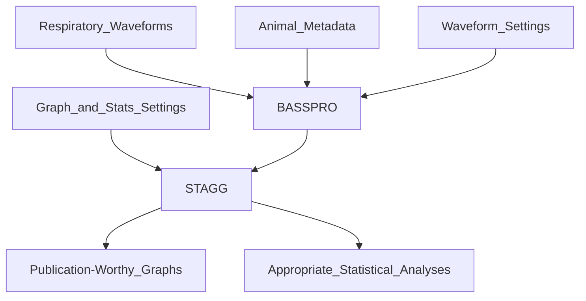

# 
<picture>
  <source media="(prefers-color-scheme: dark)" srcset="https://github.com/MolecularNeurobiology/BASSPRO-STAGG/blob/main/Logo_2.png"raw=true width="350">
  <source media="(prefers-color-scheme: light)" srcset="https://github.com/MolecularNeurobiology/BASSPRO-STAGG/blob/main/Logo.png"raw=true width="350">
  
</picture>

## What is it?
Breathe Easy is an automated waveform analysis pipeline for data gathered in whole animal plethysmography experiments. It utilizes python, pyQT, and R languages in three modules 1) Breathing Analysis Selection and Segmentation for Plethysmography and Respiratory Observations (BASSPRO), 2) Statistics And Graph Generator (STAGG), and a graphical user interface (GUI) to allow for high-thruput, consistent analysis of respiratory waveforms.



## How to cite this software?

# Where to get it?
Our software is available as source code and as a windows executable with all dependencies for the release. The executable is available in the BASSPRO-STAGG_QUIPPL folder and can be launched after downloading to a PC. 

# Where is the manual?
[User Manual](https://www.molecularneurobiology.github.io/BASSPRO-STAGG/) for this software.


# Where is practice data?
Instructions for accessing, downloading, and running practice datasets can be found in the [User Manual](https://molecularneurobiology.github.io/BASSPRO-STAGG/).

# Dependencies
The prepackaged release of Breathe Easy includes all dependencies. If running from source, you will need to ensure download and installation of dependencies which can be performed via the following instructions.

Python
- numpy==1.23.1 
- pandas==1.4.3
- pyodbc==4.0.34
- PyQt5==5.15.7
- PyQt5-Qt5==5.15.2
- PyQt5-sip==12.11.0
- python-dateutil==2.8.2
- pytz==2022.1
- scipy==1.9.0
- six==1.16.0
R
- rjson
- tidyverse
- magrittr
- data.table
- ggpubr
- kableExtra
- rmarkdown
- argparser
- lme4
- Matrix
- multcomp
- mvtnorm
- survival
- TH-data
- xtable
- tidyselect
- ggthemes
- RcolorBrewer
- openxlsx
- reshape2
- svglite
- systemfonts
- lmerTest
- purrr
- scales
- MASS
- nloptr
- nlme
- ggrepel
- gridExtra

# Installation
## Install Python3
Download python [here](https://www.python.org/downloads/)

## Install Dependencies
Activate Python virtual environment to help manage package installation.
```
# Posix
python3 -m venv <venv>
source <venv>/bin/activate

# Windows
python3 -m venv <venv>
<venv>/Scripts/activate.bat
```
Install dependencies
```
pip install -r requirements.txt
```

Dependencies for R should be downloaded and installed upon the first run of StaGG.

# How to launch?
## From packaged version
Double click the `launch.bat` file in the BASSPRO-STAGG_QUIPPL folder.

## From source
```
# Posix
source venv/bin/activate
python3 scripts/GUI/MainGUImain.py

# Windows
<venv>/Scripts/activate.bat
python3 scripts/GUI/MainGUImain.py
```

# Licensing
<section under review>
'Breathe Easy' is dually licensed. The project is available under a 'GPLv3 or later' license as well as a commercial license (inquiries for commercial licensing may be directed to Russell.Ray@bcm.edu). The fully packaged version of 'Breathe Easy is distributed under a 'GPLv2 or later' license.
</section under review>
